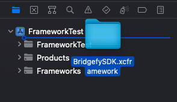
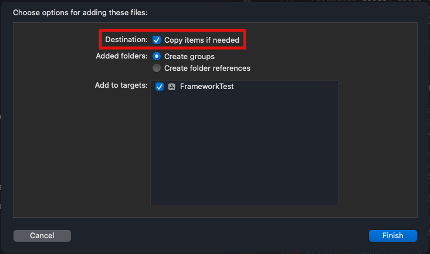
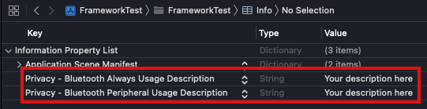

# SDK iOS Beta Documentation

# Bridgefy

## Overview

The Bridgefy Software Development Kit (SDK) is a state-of-the-art, plug-and-play package of awesomeness that will let people use your mobile app when they don’t have access to the Internet by using mesh networks.

Integrate the Bridgefy SDK into your Android and iOS app to reach the 3.5 billion people that don’t always have access to an Internet connection, and watch engagement and revenue grow!

**Website**. https://bridgefy.me/sdk/

 **Email**. contact@bridgefy.me

**Twitter**. https://twitter.com/bridgefy 

**Facebook**. https://www.facebook.com/bridgefy

## Operation mode

All the connections are handled seamlessly by the SDK to create a mesh network. The size of this network depends on the number of devices connected and the environment as a variable factor, allowing you to join nodes in the same network or nodes in different networks.


## Installation

1. Clone this repository or download the `BridgefySDK.framework` from this [link](https://bridgefy.me/beta/BridgefySDK.xcframework.zip).
2. Drag the `BridgefySDK.framework` folder to the top of your project's hierarchy in Xcode.

<p align=center>

</p>

3. Select the option `Copy items if needed` from the dialog window that appears after releasing the folder into your project.

<p align=center>

</p>

4. Import the Bridgefy SDK using the following code:

```swift
import BridgefySDK
```

### Permissions

The BridgefySDK requires permission to use the Bluetooth antenna of the devices where it's installed; to achieve this you have to add a couple of entries on the `Info.plist` of your project, the entries are depicted in the following image:

<p align=center>

</p>

## Usage

### Start the SDK

The following code shows how to start the SDK (using your API key) and how to assign the delegate.

```swift
do {
    try Bridgefy.manager.start(withAPIKey apiKey: String,
                               delegate: BridgefyDelegate)
} catch {
    // Handle the error
}

```

The string **apiKey** represents a valid API key. An Internet connection is needed at least for the first time in order to validate the license.
The **delegate** is the class that will implement all the delegate methods from the BridgefySDK.

Once the service is started, the following delegate function is called:

```swift
func bridgefyDidStart(with currentUserID: UUID)
```

The **currentUserID** is the id used to identify the current user/device in the BridgefySDK.

In the case an error occurs while starting the BridgefySDK, the following delegate function is called:

```swift
func bridgefyDidFailToStart(with error: BridgefyError)
```

To stop the SDK, use the following function:

```swift
 Bridgefy.manager.stop()
```

### Nearby peer detection

The following method is invoked when a peer has established connection:

```swift
func bridgefyDidConnect(withUserID userID: UUID)
```

**userID**: Identifier of the user that has established a connection.

When a peer is disconnected(out of range), the following method will be invoked:

```swift
func bridgefyDidDisconnect(fromUserID userID: UUID)
```

**userID**: Identifier of the disconnected user.

### Sending data

The following method is used to send data using a transmission mode. This method returns a UUID to identify the message sent.

```swift
do {
    let messageID = try send(_ data: Data,
                             using transmissionMode: BridgefyTransmissionMode)
} catch {
    // Handle the error
}
```

**messageID**: Unique identifier related to the message.

If the message was successfully sent the following delegate method is called:

```swift
func bridgefyDidSendMessage(with messageID: UUID)
```

**messageID**: The unique identifier of the message sent.

***Note:*** Is important to notice that the call of this delegate method doesn't mean that the message was delivered, this is due to the nature of how the mesages travel through the mesh network created by the BridgefySDK. The ONLY scenario where you can assume that the message was delivered is when it was sent using the `p2p` transmission mode; otherwise it only means that there's no pre-validation error and the SDK will start propagating the message.

If an error occurs while sending a message, the following delegate method is called:

```swift
func bridgefyDidFailSendingMessage(with messageID: UUID,
                                   withError error: BridgefyError)
```

### Receiving Data

When a packet has been received, the following method will be invoked:

```swift
func bridgefyDidReceiveData(_ data: Data,
                            using transmissionMode: BridgefyTransmissionMode)
```

**data**: Received data.
**transmissionMode**: The transmission mode used to deliver the message, from here you can get the messageID of the sender.

**Transmission Modes**:

```swift
enum BridgefyTransmissionMode {
    case p2p(userID: UUID)
    case mesh(userID: UUID)
    case broadcast
}
```

There are several modes for sending packets:

**p2p(userID: UUID)**: Sends the message data only when the receiver is in range, otherwise an error is reported.
**mesh(userID: UUID)**: Sends the message data using the mesh created by the SDK. It doesn’t need the receiver to be in range. 
**broadcast**: Sends a packet using mesh without a defined receiver. The packet is broadcast to all nearby users that are or aren’t in range.

***Note:*** The mesh and broadcast modes will be available in a feature release of the SDK.

### Direct and mesh transmission

Direct transmission is a mechanism used to deliver packets to a user that is nearby or visible (a connection has been detected).

Mesh transmission is a mechanism used to deliver offline packets even when the receiving user isn’t nearby or visible. It can be achieved taking advantage of other nearby peers; these receive the package, hold it, and forward to other peers trying to find the receiver.